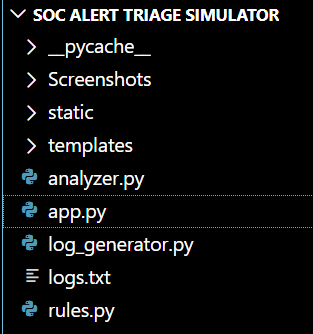

# 🛡️ SOC Alert Triage Simulator

A lightweight **Security Operations Center (SOC) simulation platform** built using Python and Flask that processes system logs, detects security threats using rule-based logic, and visualizes incidents in a web dashboard.

---

## 🚀 Features

- 📄 Log ingestion and parsing system
- ⚠️ Rule-based threat detection engine
- 🧠 Incident classification (HIGH / MEDIUM / CRITICAL)
- 📊 Web-based SOC dashboard
- 🔄 Modular and scalable architecture

---

## 🏗️ Project Structure


---

## ⚙️ Tech Stack

- Python 3
- Flask
- HTML5
- CSS3
- Jinja2 Templates

---

## 🧪 How It Works

1. Logs are read from `logs.txt`
2. `analyzer.py` processes and groups events
3. `rules.py` applies detection logic
4. Flask renders results in dashboard UI

---

## 📌 Detection Rules

- **Brute Force Attack**
  - Trigger: 3+ failed login attempts
  - Severity: HIGH

- **Port Scan Activity**
  - Trigger: 2+ scan events
  - Severity: MEDIUM

- **Malware Detection**
  - Trigger: direct detection event
  - Severity: CRITICAL

---

## 📸 Screenshots

### Dashboard View


### Incident View


---

## ▶️ Run Locally

```bash
pip install flask
python app.py

## 🔮 Future Improvements
Real-time log streaming
MITRE ATT&CK mapping
ML-based anomaly detection
Live SOC dashboard UI
Authentication system
## 

Author
abhiBanerjee